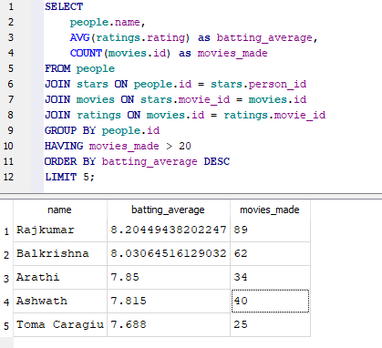
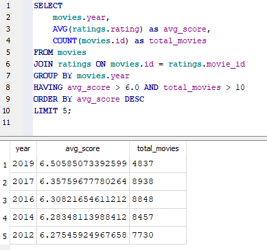
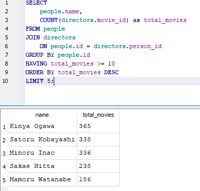

# 🎬 IMDB Movie Data Analysis (SQL)

### 📌 Project Overview
The goal of this project was to analyze historical movie data to identify key trends in cinema success. Using **SQL**, I investigated the relationship between runtime, genre, and user ratings to determine what factors contribute to a "hit" movie.

### 📂 Project Files
| File Name | Description |
| :--- | :--- |
| **IMDB_Analysis.sql** | The raw SQL scripts used for data extraction and analysis. |
| **actor_batting_avg_preview.png** | Insight: High-consistency actors. |
| **golden_era_preview.png** | Insight: Best years for cinema. |

### 📊 The Database
**Source:** IMDB Relational Database (SQLite Version)
**Structure:** `movies`, `people`, `stars`, `directors`, `ratings`

### 🧠 Key Business Insights

#### 1. "Star Power" Analysis (Complex 4-Table Join)
**Question:** Which actors have the highest "Batting Average" (consistent high ratings)?
**SQL Skill:** `INNER JOIN` (4 tables), `AVG()`, `HAVING`.
**Result:** Regional stars like **Dr. Rajkumar** outperform global stars in consistency.
*(See code and result below)*

#### 2. The "Golden Era" of Cinema
**Question:** Which years had the highest average quality (min. 10 movies)?
**SQL Skill:** `GROUP BY`, `HAVING` vs `WHERE`.
**Result:** Older eras (e.g., 1920s-40s) show higher average ratings due to survivorship bias/lower volume.
*(See code and result below)*

#### 3. Director Efficiency
**Question:** Who are the most prolific directors in history?
**SQL Skill:** `COUNT()`, Sorting `DESC`.
*(See code and result below)*

---
*Created as part of a Data Analytics Portfolio Project.*
